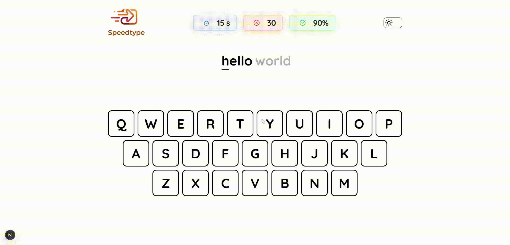
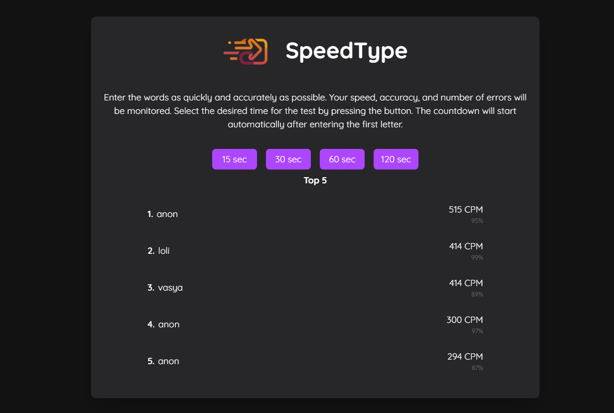
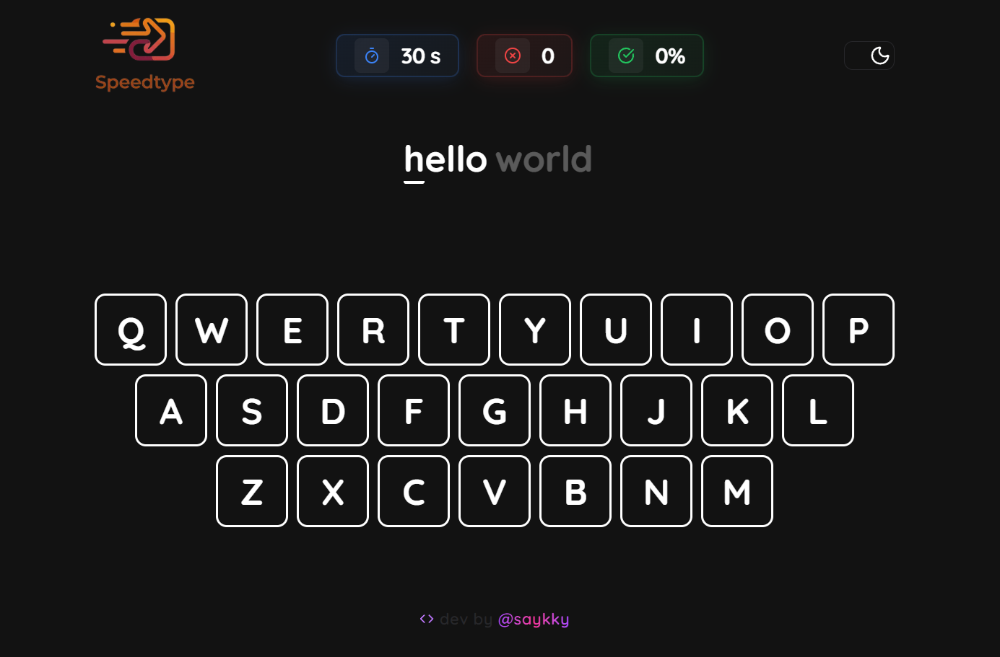
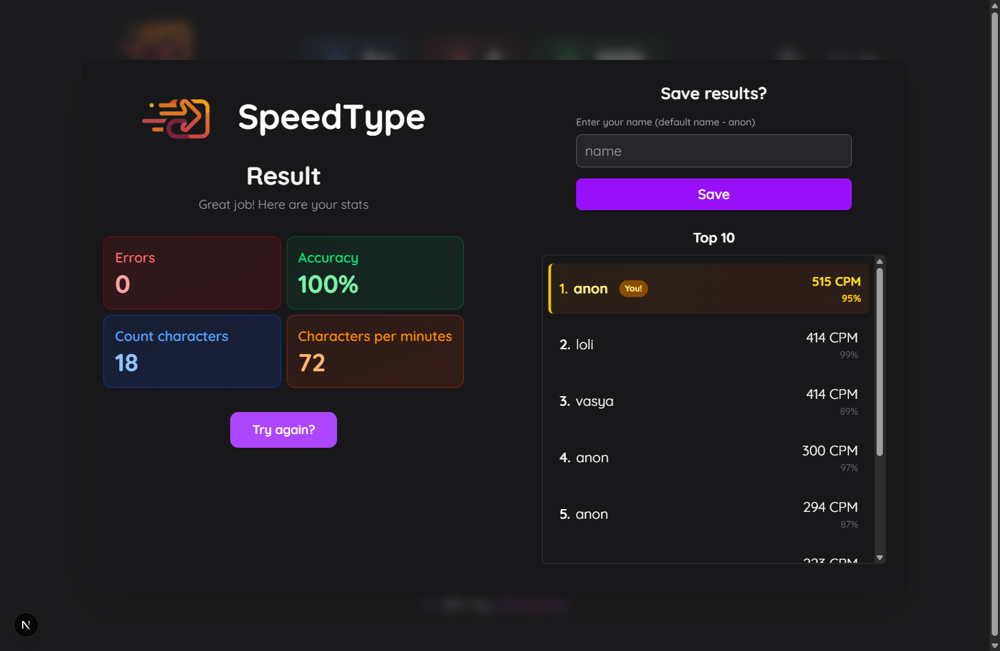
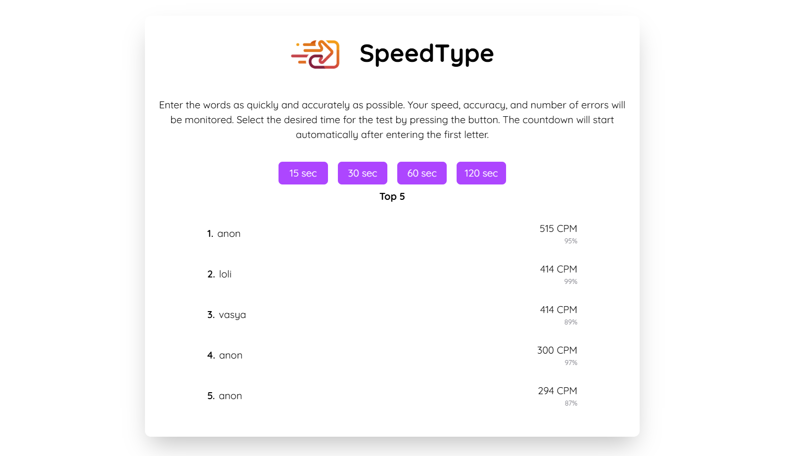
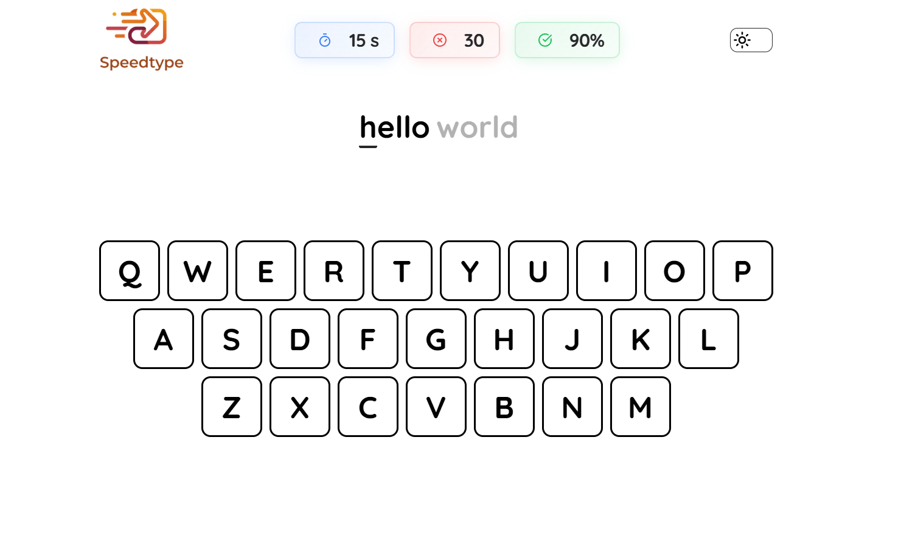
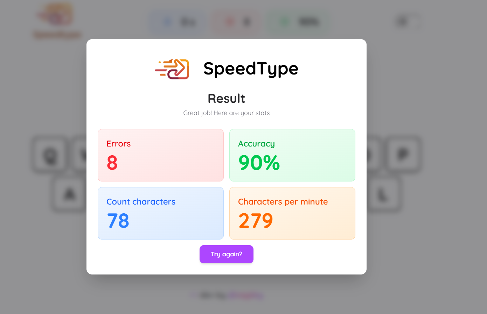
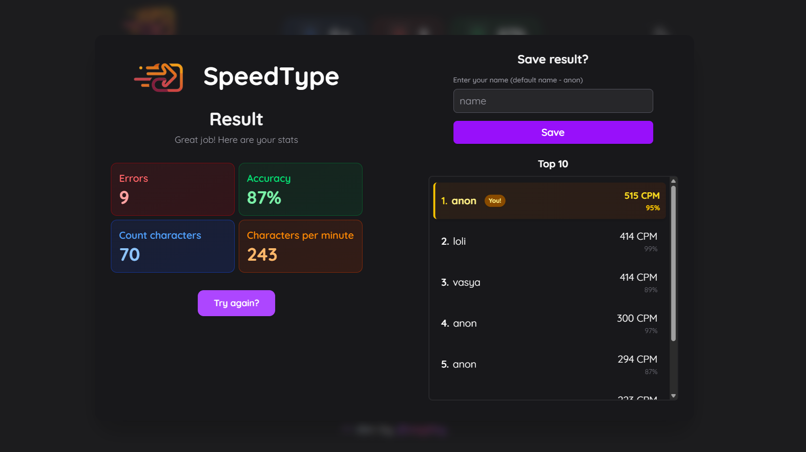

<div align="center">
  
</div>


#  **SpeedType** [](https://opensource.org/licenses/MIT)

Fast typing trainer with CPM tracking, error stats, themes, and leaderboard. Practice and compete!

## Demo [click me](https://speed-type-two.vercel.app/)
<div align="center">
  
</div>

# 🛠 Tech Stack

- **React 19**
- **Next.js 15**
- **TypeScript**
- **Tailwind CSS**
- **next-themes** for theme switching
- **Lucide React** for icons
- **Supabase** database

## ⚡ Features

- 🕒 Countdown timer
- ✅ Error and accuracy tracking
- 🔄 Theme switcher: Light / Dark / System
- 🎹 Visual keyboard
- 🔧 Custom hooks: [useTypingWords](src/app/hooks/useTypingWords.ts), [useTypingTrainer](src/app/hooks/useTypingTrainer.ts)
- 🗃️ Supabase integration
- 🌟 Leaderboard of the best users

## 🙏🏻 Acknowledgments
- [](https://supabase.com/)

## Preview dark theme
<div align="center">
  
</div>
<div align="center">
  
</div>
<div align="center">
  
</div>

## Preview light theme
<div align="center">
  
</div>
<div align="center">
  
</div>
<div align="center">
  
</div>

## Preview highlighting in the top
<div align="center">
  
</div>
# 🚀 Getting Started

### 1. Clone the repo:
```bash
git clone https://github.com/saykky/speed-type
cd speedtype
```

### 2. Install dependencies:
```bash
npm install
# or
yarn install
```

### 3. Run the development server:
```bash
npm run dev
# or
yarn dev
```

### 4. Open http://localhost:3000 in your browser
